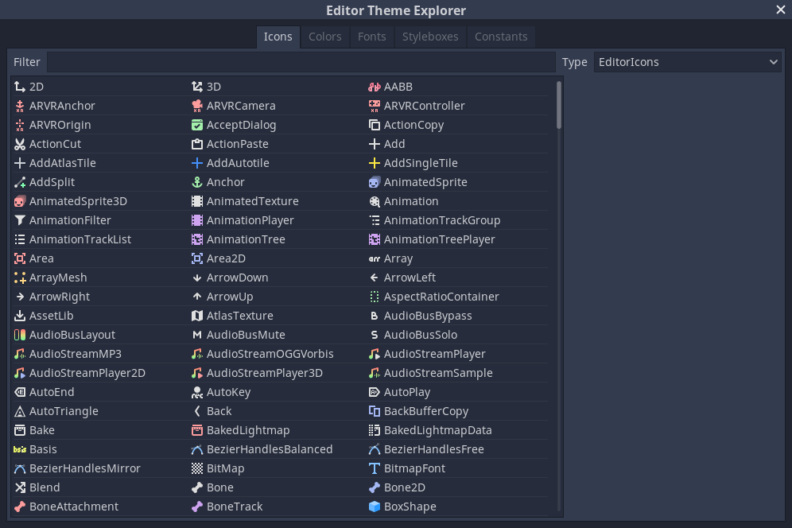
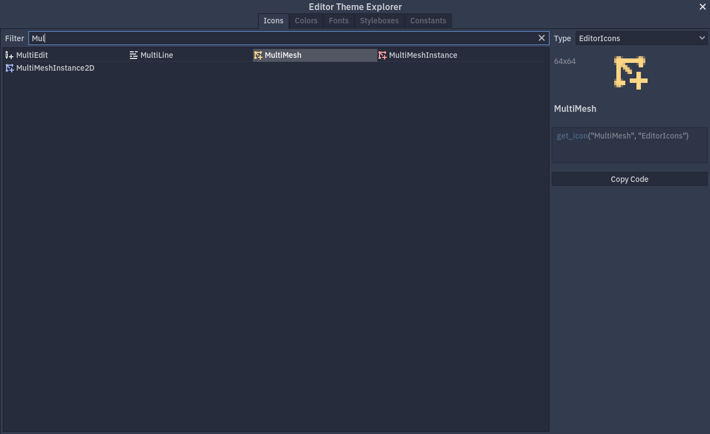
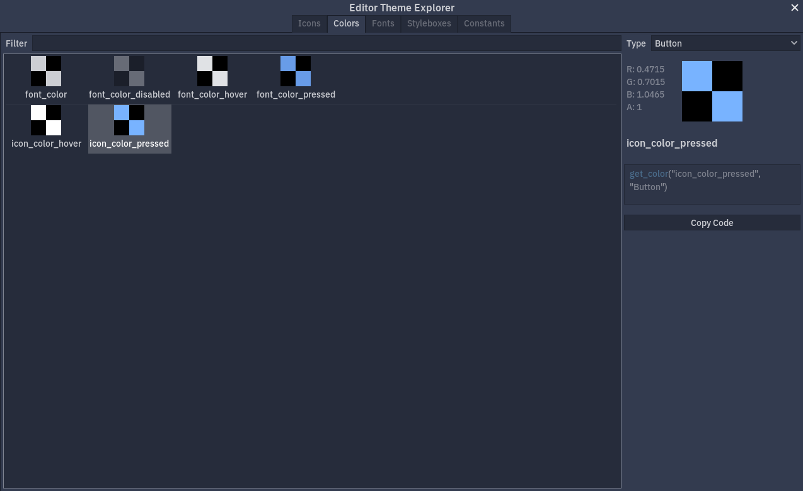
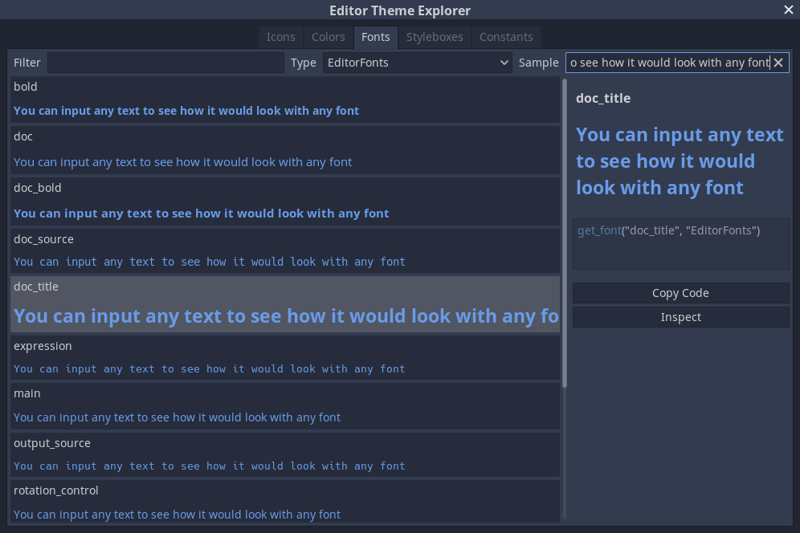
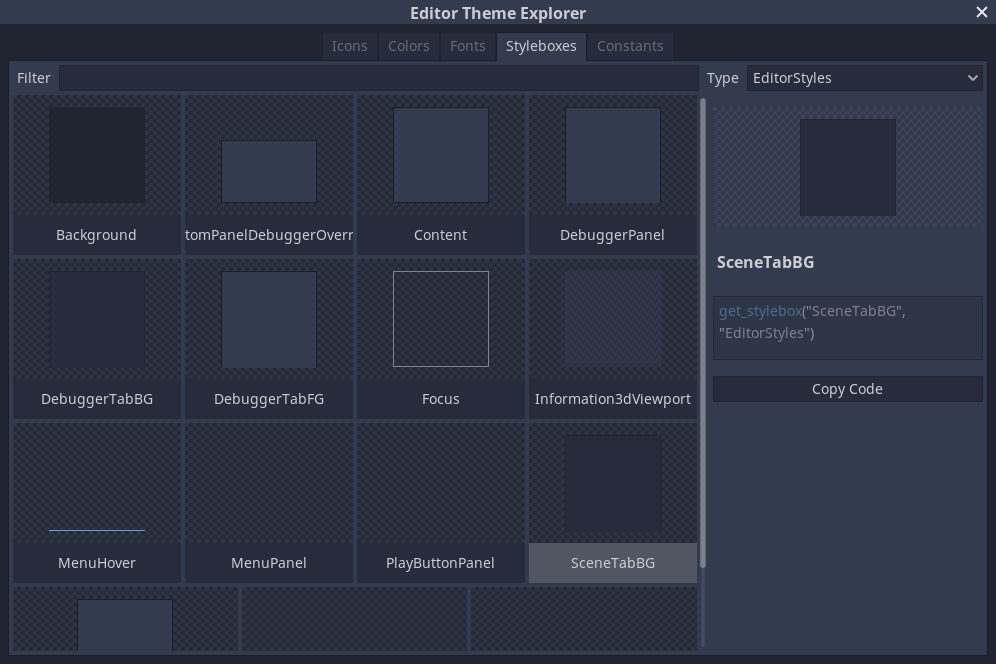
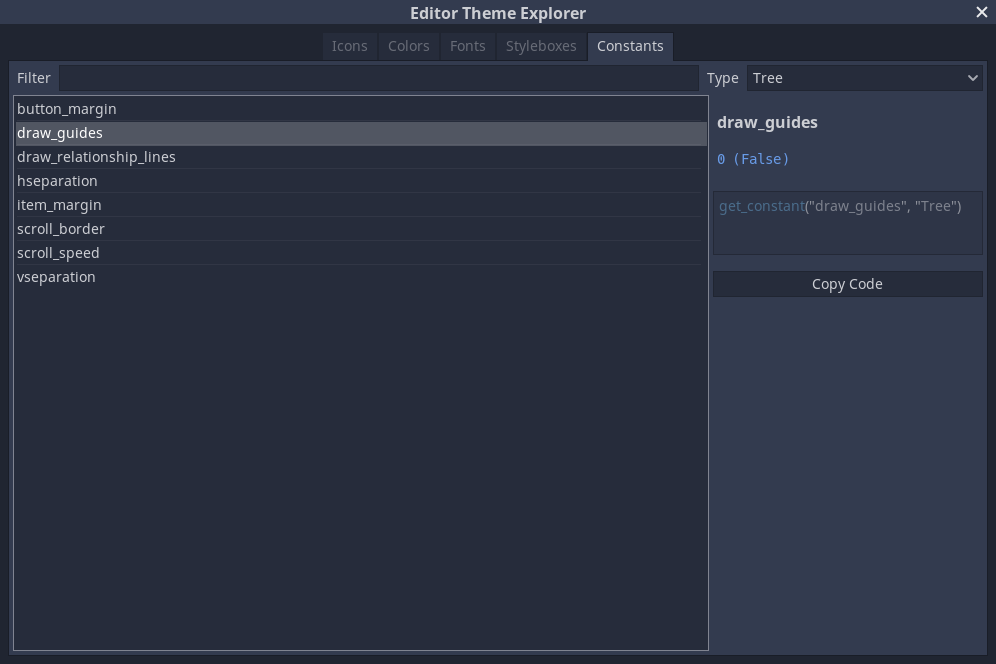

# Godot Editor Theme Explorer
Editor plugin which allows plugin developers to quickly reference various `Theme` properties defined in the main Editor Theme. This allows creators to make GUI for their plugins as seamless as possible, relying on style definitions made by Godot Engine developers and giving their users a consistent look across the board.

Developed in and tested against Godot 4.2. For the version compatible with Godot 4.0/4.1 see the `4.0` branch.

## Installation
Clone this repository or download it as ZIP. You only need to put `addons/explore-editor-theme` folder inside your project folder. ZIP already has only necessary files.

## Features
This plugin consists of a single window, available from **Project > Tools** menu.

There are 5 sections, giving access to *Icons*, *Colors*, *Fonts*, *StyleBoxes*, and *Constants*. All of them feature a list of entries, which can be filtered by name and by type. List entries display their name and, if possible, a small preview of their visual aspect. Selected entries can be previewed further, with additional information and a code snippet to use them.

### Icons

Icons are listed with their name and a 16x16 preview image. Most of the icons are only usable at that scale. In the right-hand panel a bigger preview image is displayed, at 64x64.

Icons can be saved as a PNG file, however only at their current scale. Editor icons are generated at runtime from SVG sources depending on the editor scale setting. Consider locating the icon you need in [Godot's sources](https://github.com/godotengine/godot/tree/master/editor/icons).

### Colors

Colors are displayed using a checkered black-and-white texture, to give a better representation for semi-transparent colors. The right-hand panel features RGBA aspects of each color.

### Fonts

Fonts are demonstrated using a sample text, that can be customized by a user.

Fonts can also be explored in the Inspector as a normal resource.

### StyleBoxes

StyleBoxes are previewed by being applied to a small `Panel`. A lot of them do not carry any visual style, or can have a style that matches background, so a checkered background is used once again to give a better idea of what each StyleBox does.

StyleBoxes can also be explored in the Inspector as a normal resource.

### Constants

Constants are only displayed by their name in the list. Values can be viewed in the right-hand panel. It should be noted, that constants are always returned as `int`s, though sometimes they are used as `bool`s. Preview demonstrates both interpretations of the value.

## License
This project is provided under [MIT License](LICENSE).
