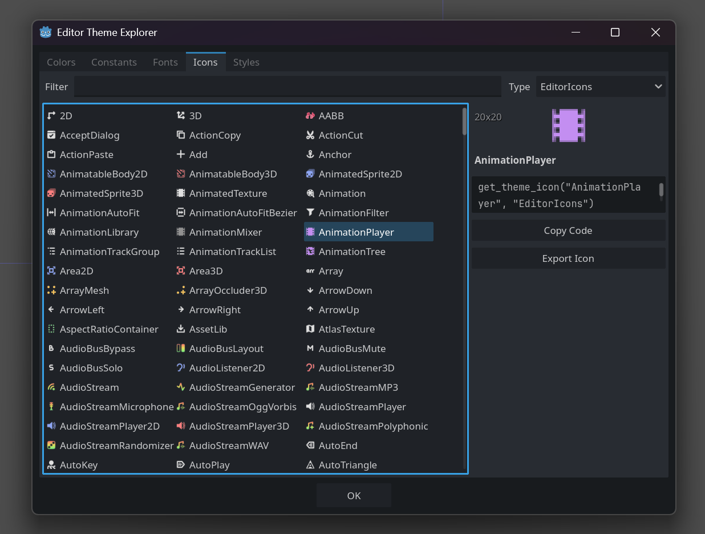
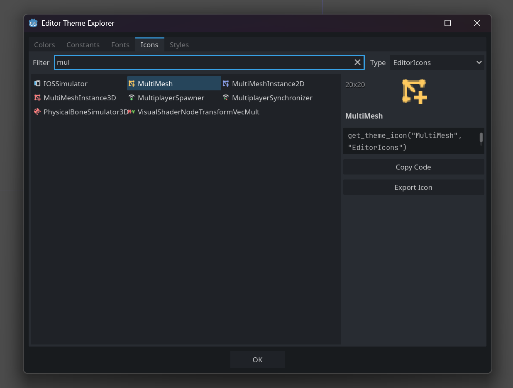
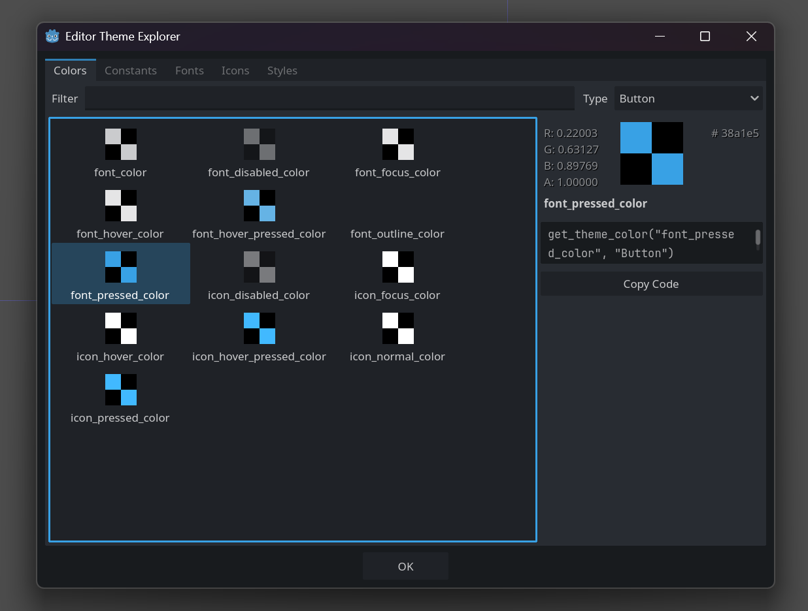
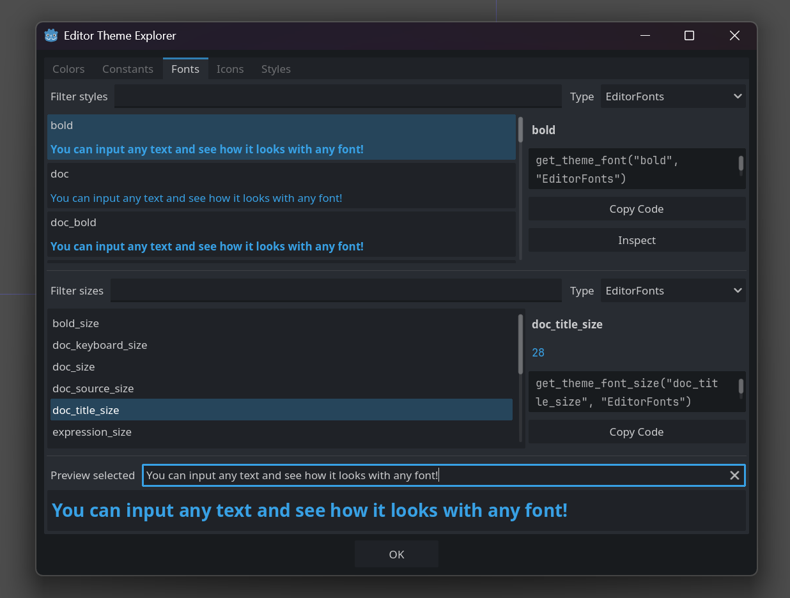
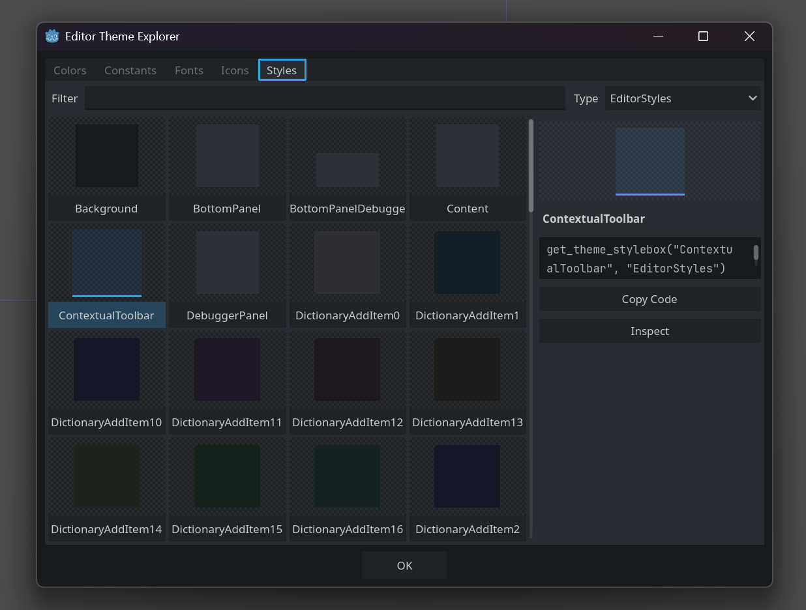
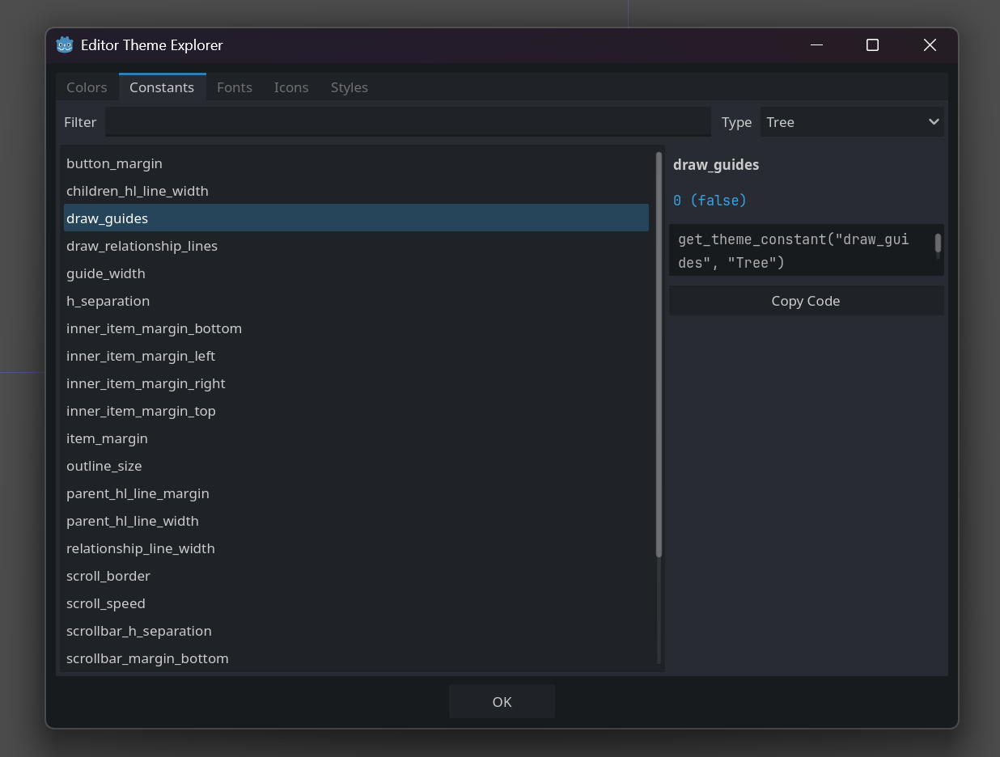

# Editor Theme Explorer for Godot

**Editor Theme Explorer** is an editor utility which allows plugin developers to quickly
reference various definitions and properties defined in the current editor GUI theme. Take
advantage of that and create plugins with consistent UI which respects user preferences!

Thanks to the Godot theming systems, all GUI nodes inside of the editor node tree can use
the editor theme directly without any hassle. Built-in Control and Window nodes added by
plugins implicitly inherit visuals from the current editor. But the editor `Theme` resource
also provides a bunch of specialized definitions for various widgets in the editor, as well
as all icons used throughout the GUI. You just need to know how reference them.

And this is where _Editor Theme Explorer_ comes in! Through an intuitive UI with filtering
capabilities and clear previews plugin developers can learn about various definitions used
in making of the Godot editor and find keys and names needed to get them.

	

This version supports Godot 4.2 and later (sans script UIDs). For the version compatible with Godot 4.0/4.1 see the `4.0` branch.

## Installation

Clone this repository or download it as ZIP. You only need to put `addons/explore-editor-theme` folder inside your project folder. ZIP already has only necessary files.

You can also install via the AssetLib tab in the editor: https://godotengine.org/asset-library/asset/2353.

## Features

You can open the explorer window via the **Project > Tools > Editor Theme Explorer** menu. Through this window you can:

- List all colors, constants, fonts, font sizes, icons, and styles defined in the current editor theme.
- Search through each category and filter them by theme type.
- Get code necessary to fetch desired item.
- and, do some other things with specific items!

	
	
	
	
	

### Colors

Colors are listed with a checkerboard preview, which aims to make semi-transparent colors
more readable and easy to understand. When selected, color aspect values and hex code are
displayed in the sidebar on the right.

### Constants

Constants are listed only by their name. When selected, their numeric and boolean
representation is displayed in the sidebar on the right. Both representations may be relevant,
as Godot themes often use constants for boolean flags, even though integers are the only
supported constant type.

### Fonts

Fonts are previewed with a sample text, which can be edited to see how a particular font fits
your specific case. Font sizes are listed on the same tab, but separately, allowing you to
mix and match them with any font.

Fonts can also be inspected as a resource via the main editor Inspector.

### Icons

Icons are listed as 16x16 preview image, which is the most commonly used internal scale for
Godot icons. When selected, a larger preview is displayed in the sidebar on the right.

Icons can be saved as PNG files, but only at their current scale. Though [Godot icons](https://github.com/godotengine/godot/tree/master/editor/icons)
are created as SVG files, they are rasterized according to the current editor scale setting
at runtime. If you need original SVG files, you can use the name to find it in Godot sources.

### Styles

Styles (styleboxes) are listed as a styled panel drawn over a checkerboard background. This allows semi-transparent and fully transparent (empty) styles to be more easily distinguishable,
especially against the panel in the background of the explorer window itself.

Styleboxes can also be inspected as a resource via the main editor Inspector.

## License

This project is provided under an [MIT license](LICENSE).
